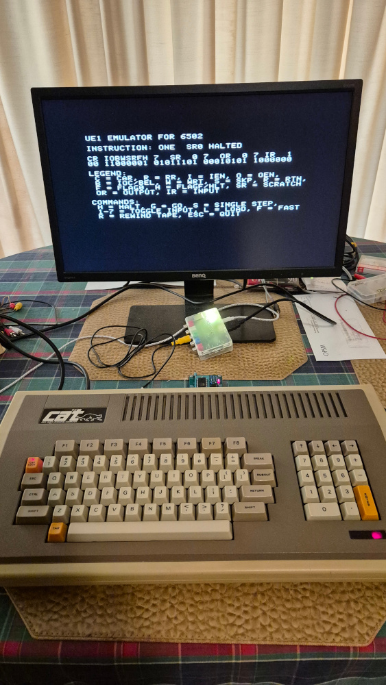

UE1 Emulator for 6502
=====================

This is an emulator for the UE1 vacuum tube computer from
[David Lovett / Usagi Electric](https://github.com/Nakazoto/UEVTC) that
runs on [Ben Eater's 6502 Breadboard Computer](https://eater.net/6502)
or Apple II (or clones).

Most of the instructions below pertain to the Ben Eater version.
See the end of this file for information on the Apple II version.

## Building and Running

You can program the pre-built "UE1\_6502.bin" image directly into EEPROM,
or use [vasm](http://sun.hasenbraten.de/vasm/) to build the "UE1\_6502.s"
source file yourself.

Set your terminal program to 19200 bps, N-8-1 to access the 6502 computer
via serial.  RTS handshaking should be enabled in the terminal program,
and on your breadboard computer.  Reset the computer and the main screen
should display.

## Examples

Here is the emulator running the "UE1FIBO" program that calculates the
Fibonacci sequence up to 21.  This example is built into the emulator,
so all you have to do is press "G" to "Go" after power up:

The emulator has a built-in assembler so you can type programs
directly into it, or paste them in from another window.  Here is an
example of typing in a program to blink OR7 on and off constantly:

When pasting in programs, I recommend slowing down your terminal program
so as not to overload the system.  The emulator uses RTS handshaking to
slow down the host computer, but there is a bug in the ACIA chip that
can cause it to appear to lose characters when RTS is off.  The characters
won't actually be lost, but they won't echo properly.

## DIAPER

The "diaper" directory contains a UE1 program in ASM and BIN form for
testing all of the functionality of the UE1 except for inputs and outputs,
which require human intervention.

The program is named after the Bendix G-15 "DIAPER" program, which means
"Diagnostic Program for Easy Repair" and fills a similar function.

The 6502 emulator contains a copy of DIAPER built in.  Press 'D' followed
by 'G' to run the tests.  If all goes well, it will halt at the end of
the program with all outputs set to 1.  If something goes wrong, it will
halt with the number of the failing test displayed on the outputs.

## Control Keys

* H - Halt the machine.
* G - Go, resume program execution.
* S - Single step an instruction.
* 1-7 - Toggle one of the bits in the input register (IR).
* L - Load a program.
* R - Rewind the tape to the start.
* F - Toggle fast execution.

## Performance Considerations

The emulator runs at about 33Hz, give or take.  This speed is determined
by the 19200 bps serial port speed.  At that speed, the program can
print no more than 1920 characters per second.

Unlike other UE1 emulators that print the registers' contents on different
lines of the screen, I try to pack everything into a single line.
This minimises serial traffic when executing code.

Printing the machine state every instruction needs 55 characters,
which gives a maximum theoretical UE1 speed of 1920 / 55 = 34.9Hz.
Due to other overheads, the true speed is about 33Hz.

If you want the program to run faster, then press "F" for "fast mode".
The state will change to "----" characters and the code will run as
fast as the 6502 can manage, stopping when either the program halts or
the user hits the "H" key.

It may be possible to make the emulator run faster by optimising what
is drawn after each instruction.  If the instruction is not "STO" or
"STOC", then SR and OR will not be affected.  And IR is only affected
when the user toggles an input bit.  So it may not be worth printing the
SR, OR, and IR values every instruction.  I haven't done this
optimisation yet.

If the serial port speed was increased to 115200 bps, then a UE1 clock
speed of 200Hz or more might be achievable.  Unfortunately, 115200 bps
is right on the outer limit of what a 1MHz 6502 can manage.  It would
be necessary to also increase the 6502's CPU clock to 2MHz or more.

## Memory Map

* $0000 - $00FF : Machine state for the UE1.
* $0100 - $01FF : Stack.
* $0200 - $02FF : Keyboard buffer for entering programs.
* $0300 - $03FF : Serial receive buffer.
* $0400 - $3FFF : Storage for the program tape (max 15k, or about 128 feet of physical tape).
* $5000 - $5003 : ACIA registers for the serial port.
* $8000 - $FFFF : Emulator code in EEPROM (only about 2.75k is in use).

## Apple II and Clones Version

I have a [Dick Smith CAT](https://github.com/rweather/cat-technical-information),
a clone of the Apple IIe that was popular in Australia during the 1980's.
It was my first computer!

I ported the emulator to the CAT.  The port should also work on real
Apple II's and other clones but I have not tested this yet.

The "UE1\_APPLE2.bin" file is a "BRUN" executable suitable for use on
Apple DOS or compatible systems.  May not work with Apple ProDOS.
Arrange to somehow copy this file to an Apple II disk image and
mount the disk on your Apple II.

Because I don't have a working disk controller, I have another method to load
programs onto the Dick Smith CAT using a [[ROM Cartridge](https://github.com/rweather/cat-technical-information/blob/main/ROMCart.md)
that plugs into the RS-232 expansion connector on the back of the CAT.
The "UE1\_DSECAT.bin" file is designed for the ROM cartridge; it is
otherwise exactly the same code as the Apple II version.

The Apple II and CAT versions are loaded into memory at $2000.  Tape
images are stored between $3000 and $7FFF in RAM (max 12K).

Here is the emulator running on my CAT just after it finished running
"UE1FIBO".  The emulator runs about twice as fast as on Ben Eater's
6502 Breadboard Computer because it doesn't have to wait for the
serial port to catch up.

## License

MIT License

## Contact

For more information on this project, to report bugs, or to suggest
improvements, please contact the author Rhys Weatherley via
[email](mailto:rhys.weatherley@gmail.com).
